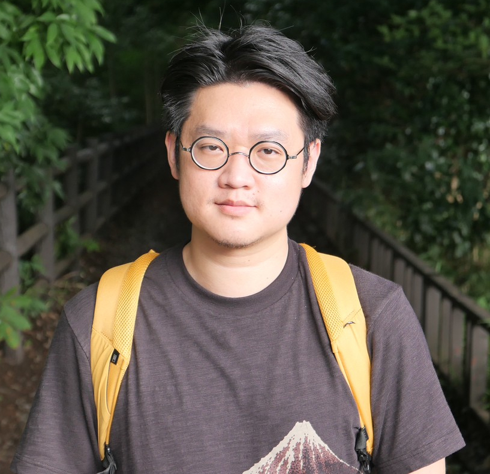

  <a href="#research" class="btn btn-outline-primary">Research</a>
  <a href="#works" class="btn btn-outline-primary">Publications</a>
  <a href="#projects" class="btn btn-outline-primary">Projects</a>
  <a href="#misc" class="btn btn-outline-primary">Misc</a>

## 👋 About Me {id="about"}

   

  

    **Postdoc in ML & Maths | PhD in Applied Maths | ENS Lyon**
  

  
  

  I am a postdoctoral researcher at [Centre Inria d'Université Côte d'Azur](https://www.inria.fr/fr/centre-inria-universite-cote-azur) and [Laboratoire J.A. Dieudonné](https://math.univ-cotedazur.fr/). My current work focuses on Control theory for neural network analysis and Physics-Informed Machine Learning, with keen interests in quantum computing and AI4Materials.

    Previously, I was a postdoctoral researcher at [Institut Jean Lamour](https://ijl.univ-lorraine.fr), University of Lorraine. I received my Ph.D. in Applied Mathematics at [Institut Camille Jordan](https://math.univ-lyon1.fr/icj/), University of Lyon. My manuscript can be found [here](https://theses.hal.science/tel-03584255). 
  

  
  

    [<i class="fa-brands fa-github"></i> GitHub](https://github.com/chih-kang-huang) &bull;
    [<i class="fa-brands fa-linkedin"></i> LinkedIn](https://linkedin.com/in/chih-kang-huang/) &bull;
    [<i class="fa-solid fa-envelope"></i> Email](mailto:chih-kang.huang@hotmail.com)
  

<!---

  <a href="#research" class="btn btn-outline-primary">Research</a>
  <a href="#works" class="btn btn-outline-primary">Publications</a>
  <a href="#projects" class="btn btn-outline-primary">Projects</a>
  <a href="#misc" class="btn btn-outline-primary">Misc</a>

--->

### 📣 News 
* [2026/03] **Invited talk** of our [work](https://www.programmaster.org/PM/PM.nsf/ApprovedAbstracts/FBC91110162EE9C785258CC5008257E0?OpenDocument) at [**TMS2026**](https://www.tms.org/TMS2026) !

## 🔬 Research {id="research"}

<!--- Summarize your main research interests, affiliations, and any ongoing projects.
--->

* Control Theory of Deep learning, Physics-Informed ML, AI4Materials
* Quantum Simulation and Control
* Analysis of PDEs and Calculus of variations

<!---
* **Topic 2:** Description of your work in this area.
--->

### 🛠️ Skills
<!---* **Mathematics :** Analysis of PDEs, Numerical Simulations, Calculus of Variations, Control theory of Machine Learning
--->
* **Programming :** Python (Pandas, scikit-learn, JAX, Pytorch), MatLab, Bash
* **Tools :** Linux, Latex, Git, Docker, Slurm (HPC), JupyterLab, Quarto
* **Languages :** **English**, **French**, **Mandarin**

---

## 📜 Publications and Preprints {id="works"}

<!---
List your publications, talks, and presentations.
--->
<!---
1.  **"Title of Paper 1"** (Year). *Journal Name*. [Link to PDF/arXiv]
2.  **"Title of Paper 2"** (Year). *Conference Proceedings*.
--->

1. with G. Antonioli, F. Barbaresco. [**A Quantum Spectral Framework For solving PDEs**](https://arxiv.org/abs/2604.25825), preprint.
1. with L. Gagnon, M. Zaloznik, B. Appolaire. [**DeepSplitRitz Neural Operator for Phase-field models via Energy Splitting**](https://arxiv.org/abs/2604.18261), preprint.
1. with J-T. Lu, H. Ennes, A. Abbassi. [**Variational Quantum Brushes**](https://arxiv.org/abs/2512.24173), preprint. 
1. with E.Bretin, S. Masnou. [**A thickness-aware Allen-Cahn equation for the mean curvature flow of thin structures**](https://arxiv.org/abs/2310.10272), Interfaces and Free Boundaries, to appear.
1. [**Questions of approximation and compactness for geometric variational problems**](https://theses.hal.science/tel-03584255), Thesis.
1. [Asymptotic Analysis of embedded Willmore spheres in 3-dimensional manifolds](https://arxiv.org/abs/1710.08732).
1. with L. Gagnon. Null controllability of Allen-Cahn eqaution, in preparation.

 
  
<h3 style="display: inline;">🗣️ Presentations (Click to Expand)</h3>

  <!--
  

  Under contruction
  

    <li>[Talk Title] at [Event Name] (Year) - [Link to Slides]</li>
    <li>[Another Talk Title] at [Another Event] (Year)</li>
    This text is initially hidden. You can place Markdown, lists, or even code blocks here.
  * Item 1
  * Item 2
  -->

* 2026 April, Séminaire de l'équipe EDP Analyse Numérique, Nice
* 2026 March, SMAI-MODE, Nice
* 2026 March, Congrès des Jeunes Chercheur.e.s en Mathématiques Appliquées, Champs-sur-Marne
* 2026 February, Séminaire Analyse et Dynamique, Laboratoire J.A. Dieudonné, Nice
* 2025 November, Séminaire Si2M/Medicis, Institut Jean Lamour, Nancy
* 2025 October, THALES JPAL Seminar on Quantum Algorithms & Computing, Remote, Palaiseau
* 2025 September, Séminaire thématiques et sessions Q&A, UM6P, Remote, Marrakech
* 2025 August, Lectures on Physics-Informed Machine Learning at the **International PEPR DIADEM Summer School**, Paris
* 2025 Juin, Presentation at **ICASP7**, Madrid
* 2024 November, Invited talk at la journée Science Ouverte, Nancy
* 2024 April, Séminaire d'EDPs, Institut Elie Cartan de Lorraine, Nancy
* 2021 June, Presentation at **SMAI2021**, la Grande-Motte
* 2019 October, Journée d'équipe EDPA, Institut Camille Jordan, Lyon
* 2019 Mars, Sémainaire Compréhensibles, Institut Fourier, Grenoble
* 2018 October, Journée d'équipe MMCS, Institut Camille Jordan, Lyon
* 2017 March, Séminaire des doctorants et doctorantes, Lyon
* 2016 May, Colloque Inter'Actions en Mathématiques, Lyon

<!---

 
  
<h3 style="display: inline;">🔢 Outreach (Click to Expand)</h3>

  Under construction
    <li>[Talk Title] at [Event Name] (Year) - [Link to Slides]</li>
    <li>[Another Talk Title] at [Another Event] (Year)</li>
    This text is initially hidden. You can place Markdown, lists, or even code blocks here.
  * Item 1
  * Item 2

--->

 
  
<h3 style="display: inline;">📚 Teaching (Click to Expand)</h3>

  

  My Teaching (mostly in french and english as well) are listed below 
  

* Ecole des Mines de Nancy
  * Cours de Remédiations Mathématiques, Master 1
  * Cours de Soutien et TD d’Analyse Numérique et Optimisations, Licence 3
  * TD de Probabilités, Licence 3
* Ecole Normale Supérieure de Lyon
  * Préparation de Leçons à l’Agrégation de Mathématiques, Master 2
  * TD de Géométrie Différentielle, Master 1
  * TD d’Equations aux dérivées partielles, Master 1
  * TD d’Analyse complexe, Licence 3
* Université Claude Bernard Lyon 1
  * TP Statistiques pour l’Informatique, Licence 2
  * Khôlles de Mathématiques, cursus Prépa
  * TD Analyse III, Licence 2
* INSA de Lyon
  * TD de mathématiques, filières classique et internationale, premier cycle
  * Tutorat de mathématiques, premier cycle
* Lycée du Parc 
  * Khôlles hebdomadaires de Mathématiques, filière MPSI

<!---
  

    test 
  

  
<h5 style="display: inline;"> Ecole des mines de Nancy</h5>

  <ul class="presentations-list">

  * [Talk Title] at [Event Name] (Year) - [Link to Slides]
  * [Another Talk Title] at [Another Event] (Year)
  * [test]

  </ul>

  ##### Ecole 

  * 1 
  * 2 
  * 4
--->

 
  
<h3 style="display: inline;"> 📏 Outreach (Click to Expand)</h3>

  <!---
  
<h3 style="display: inline;">🔢 Outreach (Click to Expand)</h3>

  

  

  --->
* Projet des Collèges **La main à la pâte** en médiations scientifiques à la Maison pour la Science en Lorraine, 2025
* Vulgarisations mathématiques organisées par **MathàLyon**, 2015–2019
* Commission de jurys à TFJM2 de Lyon, 2017
* Organiztion of [*Journée de Pi* (Spectacle musical mathématiques)](https://www.piday.fr/) à Lyon, 2016
* Soutien scolaire pour les lycéens au sein de l’association ENSeigner, 2013 – 2014

### 🔍 Supervision

* Master Internship:
  * K. Oubaha, Physics-Informed Neural Operators (PINO), Feb 2026 -- Jul 2026. Co-supervised with A. Dimokrati (UM6P) and B. Appolaire (Univ. de Lorraine). Develop a surrogate model for the mechanical response of materials by embedding physical equilibrium constraints into a neural operator.

---

## 🔨 Projects {id="projects"}
<!---
Detail any coding projects, side projects, or open-source contributions.

### Project Alpha

A brief description of Project Alpha, what it does, and what technologies you used.

* **Technologies:** Python, TensorFlow, Flask
* [Link to GitHub Repo] | [Link to Live Demo]
--->
* Contributions to [Variational Quantum Brushes](https://github.com/moth-quantum/QuantumBrush) using VQE and quantum control, Quantinuum Hackathon, Bradford 2025
* Delivered lectures on **Physics-Informed Machine Learning** at the [International PEPR DIADEM Summer School](https://ecolediadem.sciencesconf.org/resource/page/id/3), Paris 2025 
* Thales proejct on [Quantum group convolution for PDEs and Equivariant Neural Networks](https://cemracs2025.math.cnrs.fr/en/hackathon/projets/quantum-group-convolution-for-pdes/) at [CEMRACS](https://cemracs2025.math.cnrs.fr/en/), Marseille 2025
* [Chatbot for automated meal order collection](https://github.com/chih-kang-huang/nca-linebot), a chatbot to collect automatically meal orders during my mandatory civil service in Taiwan, Nantou 2023

### 💡 Hackathons
* [IBM Quantum Computing Hackathon](https://www.theglobalcity.uk/insights/quantum-computing-hackathon), [Quantum framework for dynamic portfolio optimization](https://github.com/chih-kang-huang/Quantum-dynamic-portfolio-optimization), London 2025
* [G-Research Quant Challenge](https://www.gresearch.com/events/paris-quant-challenge/), Introductory session on cointegration for pairs trading, Paris 2024.
* [CENTURI Hackathon for Quantitative Biology](https://github.com/CENTURI-Hackathon-2024), Deep single molecule unfolding detection, **First Price**, Marseille 2024. 

---

## ♦️ Misc {id="misc"}
<!---
Include anything else relevant, like teaching experience, hobbies, or blog links.

* **Teaching:** Teaching Assistant for [Course Name] (Semester)
* **Skills:** [List of relevant skills, e.g., C++, R, LaTeX, Docker]
--->
In my spare time, i enjoy studying and playing [Bridge](https://en.wikipedia.org/wiki/Contract_bridge), a probabilistic trick-taking card game. 
My system based on Precision Club and Symmetric Relay can be found [here](https://github.com/chih-kang-huang/bridge).

I also enjoy puzzle solving. For instance, [my solutions to Advent of Challenge 2025](https://github.com/chih-kang-huang/adventOfCode2025)

---

  <a href="#research" class="btn btn-outline-primary">Research</a>
  <a href="#works" class="btn btn-outline-primary">Publications</a>
  <a href="#projects" class="btn btn-outline-primary">Projects</a>
  <a href="#misc" class="btn btn-outline-primary">Misc</a>

<footer>
  
&copy; 2026 Chih-Kang Huang. All rights reserved.

</footer>
